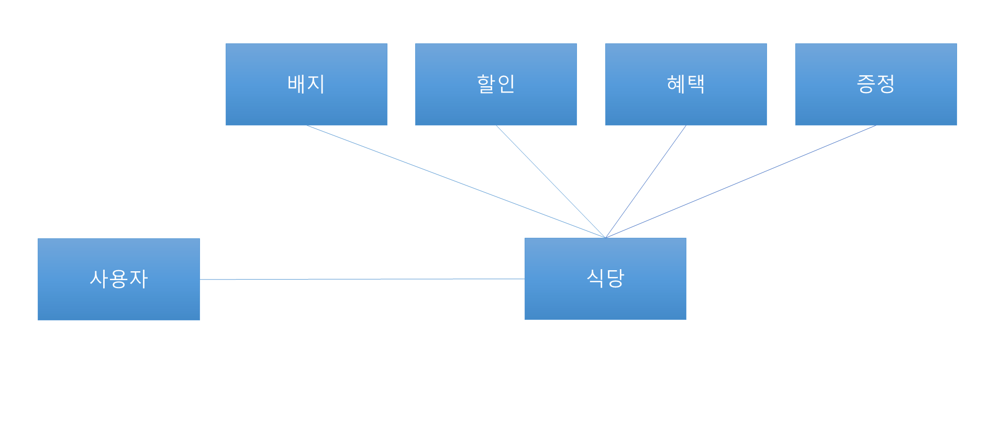

✅핵심 기능

중복 할인, 증정을 통한 물건 구매

## 기능 Todo
- [x] 실행
- [ ] 종업원
  - [x] 전달
    - [x] inputView, OutputView에게 만들어진 문자를 전달
- [ ] 식당
  - [ ] 각 기능들이 처리 된 객체들을 활용해 값을 추출
    - [x] 주문 메뉴의 이름과 개수값 추출
    - [ ] 총 주문금액 추출
- [ ] 배지
  - [ ] 유효성 검증
- [ ] 메뉴
  - [x] 식당에 각 메뉴 값 전달
    - [ ] 식당의 메뉴의 가격과 돈 합산하는 기능
  - [ ] 애피타이저
    - [ ] 선택된 애피타이저의 갯수와 돈 저장
  - [ ] 메인
    - [ ] 선택된 메인요리의 갯수와 돈 저장
  - [ ] 디저트
    - [ ] 선택된 디저트의 갯수와 돈 저장
  - [ ] 음료
    - [ ] 선택된 음료의 갯수와 돈 저장
  - [x] 받은 값 검증
    - [x] 중복 메뉴입력
    - [x] 메뉴입력형태 일치하는지
    - [x] 메뉴에 없는 음식
    - [x] 메뉴가 20개 이하
    - [x] 음료만 있는지
    - [x] 1 이상의 숫자만 입력되었는지
    - [x] 빈 값 입력
- [ ] 혜택
  - [ ] 달력을 참조해서 각 할인친구들에게 돈을 받아오는 기능
  - [ ] 디데이할인
    - [ ] 1000원 기준으로 크리스마스 D-day에 따라서 할인금액 100원씩 증가
  - [ ] 평일주말할인(음식 주문갯수도 받아야함 -> 디저트와 메인메뉴)
    - [ ] 평일(일~목)엔 디저트 메뉴 1개당 2023, 주말(금~토)엔 메인 메뉴 1개당 2023할인
  - [ ] 특별할인
    - [ ] 달력에 별이 있으면 총 주문에서 1000원 할인
  - [ ] 증정
    - [ ] 할인 전 총 금액 12만원 이상일 때 샴페인 증정
- [ ] 달력
  - [ ] 데이를 갖고있는 일급컬렉션 기능 생성
  - [ ] 데이
    - [ ] 할인 혜택을 관리
- [x] RestaurantInputView
  - [x] 식당 방문 날짜 입력
    - [x] 예외 처리
      - [x] 예외 처리 틀 잡기
      - [x] 문자가 들어왔을 때
      - [x] 1~31범위 입력인지
      - [x] 빈값인지
  - [x] 주문 메뉴 입력
- [ ] RestaurantOutputView
  - [ ] 출력값 생성
    - [x] 주문 메뉴 출력
    - [x] 할인 전 총 주문금액 출력

## Test Todo
- [x] VisitConvertor 단위테스트
- [x] MenuConvertor 단위테스트

---

---
# 설계 Flow - RDD 설계

### 협력 설계

---

**협력 시나리오 리스트** - 사용자 관점에서 주문했을 때의 주요 협력 flow

- 사용자가 식당에서 메뉴 주문을 한다.
- 식당에서 메뉴를 구매했을 때 뱃지, 할인, 혜택, 증정에게 개수와 가격을 전달한다
- 뱃지를 식당에 전달한다
- 할인을 식당에 전달한다
- 혜택을 식당에 전달한다
- 증정을 식당에 전달한다
- 식당에서 사용자에게 할인 내역과 뱃지를 전달한다.

### 협력에 필요한 객체 선택

- 종업원
- 식당
- 배지
- 메뉴
  - 애피타이저
  - 메인
  - 디저트
  - 음료
- 혜택
  - 디데이할인
  - 평일주말할인
  - 특별할인
  - 증정
- 달력
- 데이

### 객체별 행동 정의

| 객체              | 행동                           |
|:----------------|:-----------------------------|
| 종업원(Controller) | 전달                           |
| 식당              | 입력값 기준 할인, 증정 등 실제 서비스       |
| 배지              | 유효성 검증 후 사용자에게 전달            |
| 메뉴              | 식당에게 메뉴값전달                   |
| 애피타이저           | 메뉴값 전달                       |
| 메인              | 메뉴값 전달                       |
| 디저트             | 메뉴값 전달                       |
| 음료              | 메뉴값 전달                       |
| 혜택              | 각 할인유형에 따른 가격 종합             |
| 디데이할인           | 디데이유효성확인 후 돈 전달 (12.1~12.25) |
| 평일주말할인          | 평일주말 유효성 확인후 돈 전달            |
| 특별할인            | 별이 달려있는 날 유효성 확인 후 돈 전달      |
| 증정              | 12만원이상 여부, 샴페인 증정            |
| 달력(일급콜렉션)       | 데이를 관리(일급콜렉션)                |
| 데이(enum)        | 날짜별 할인혜택을 관리                 |
----

### 객체가 필요로 하는 데이터를 정의

| 객체              | 행동                           | 데이터                         |
|:----------------|:-----------------------------|:----------------------------|
| 종업원(Controller) | 전달                           | 입력, 출력                      |
| 식당              | 입력값 기준 할인, 증정 등 실제 서비스       | 할인리스트, 메뉴리스트                |
| 배지(enum)        | 유효성 검증 후 사용자에게 전달            | x                           |
| 메뉴              | 식당에게 메뉴값전달                   | 애피타이저, 메인, 디저트, 음료          |
| 애피타이저           | 메뉴값 전달                       | 애피타이저 종류와 가격                |
| 메인              | 메뉴값 전달                       | 메인메뉴 종류와 가격                 |
| 디저트             | 메뉴값 전달                       | 디저트 종류와 가격                  |
| 음료              | 메뉴값 전달                       | 음료 종류와 가격                   |
| 혜택              | 각 할인유형에 따른 가격 종합             | 달력, 디데이할인, 평일주말할인, 특별할인, 증정 |
| 디데이할인(enum)     | 디데이유효성확인 후 돈 전달 (12.1~12.25) | 크리스마스 디데이에맞는 할인금액           |
| 평일주말할인(enum)    | 평일주말 유효성 확인후 돈 전달            | 평일과 주말에 맞는 할인금액             |
| 특별할인(enum)      | 별이 달려있는 날 유효성 확인 후 돈 전달      | 별 찍혀있는날 할인금액                |
| 증정(enum)        | 12만원이상 여부, 샴페인 증정            | 샴페인 할인금액                    |
| 달력(일급콜렉션)       | 데이를 관리(일급콜렉션)                | 데이를 담고 있는 리스트               |
| 데이(enum)        | 날짜별 할인혜택을 관리                 | 무슨 할인이 들어가는지 일별체크 후 담기?     |

## 행동에 맞는 기능 목록

- 식당
  - 전달 
    - inputView, OutputView에게 만들어진 객체를 전달
- 배지
  - 유효성 검증
- 메뉴
  - 식당에 각 메뉴 값 전달
    - 식당의 메뉴의 가격과 돈 합산하는 기능
  - 애피타이저
    - 선택된 애피타이저의 갯수와 돈 저장
  - 메인
    - 선택된 메인요리의 갯수와 돈 저장
  - 디저트
    - 선택된 디저트의 갯수와 돈 저장
  - 음료
    - 선택된 음료의 갯수와 돈 저장
- 혜택
  - 달력을 참조해서 각 할인친구들에게 돈을 받아오는 기능
  - 디데이할인
    - 1000원 기준으로 크리스마스 D-day에 따라서 할인금액 100원씩 증가
  - 평일주말할인(음식 주문갯수도 받아야함 -> 디저트와 메인메뉴)
    - 평일(일~목)엔 디저트 메뉴 1개당 2023, 주말(금~토)엔 메인 메뉴 1개당 2023할인
  - 특별할인
    - 달력에 별이 있으면 총 주문에서 1000원 할인
  - 증정
    - 할인 전 총 금액 12만원 이상일 때 샴페인 증정
- 달력
  - 데이를 갖고있는 일급컬렉션 기능 생성
  - 데이
    - 할인 혜택을 관리

## 💡리마인드 목록

2주차에 받았던 공통 피드백
---------------------------
README.md 상세히 작성

기능 목록 재검토

기능 목록 업데이트

값을 하드코딩하지 않는다.

구현 순서도 코딩 컨벤션

변수 이름에 자료형 사용하지 않는다.

한 함수가 한 가지 기능만 담당하게 한다.

함수가 한 가지 기능을 하는지 확인하는 기준을 세운다

테스트를 작성하는 이유에 대해 본인의 경험을 토대로 정리해본다.

처음부터 큰 단위의 테스트를 만들지 않는다.

클래스(객체)를 분리하는 연습

도메인 로직에 대한 단위 테스트를 작성하는 연습

## 3주차 피드백

---------------------------

### 공통
- 함수(메서드) 라인에 대한 기준 main 포함하여 15줄 이내
- 발생할 수 있는 예외 상황에 대해 고민한다
- 비즈니스 로직과 UI 로직을 분리한다
- 연관성이 있는 상수는 static final 대신 enum을 활용한다
- final 키워드를 사용해 값의 변경을 막는다
- 객체의 상태 접근을 제한한다
- 객체는 객체스럽게 사용한다 - getter -> contains
- 필드(인스턴스 변수)의 수를 줄이기 위해 노력한다
- 성공하는 케이스 뿐만 아니라 예외에 대한 케이스도 테스트한다
- 테스트 코드도 코드다
- 테스트를 위한 코드는 구현 코드에서 분리되어야 한다
- 단위 테스트하기 어려운 코드를 단위 테스트하기
- private 함수를 테스트 하고 싶다면 클래스(객체) 분리를 고려한다

## 피어리뷰
- 상속보단 상태의 조합을 통해 객체를 만들기
- enum 잘 활용하기 -> enumMap등

## 개인적 리마인드
- 클래스는 상수, 멤버 변수, 생성자, 메서드 순으로 작성한다 -> 잘 못지킨 것 같아 한번 더 리마인드
- 객체가 필요로 하는 데이터를 정의
- 행동에 맞는 기능 목록
- 용도에 맞는 패키지 분리
- 의존성 주입하기!!📌